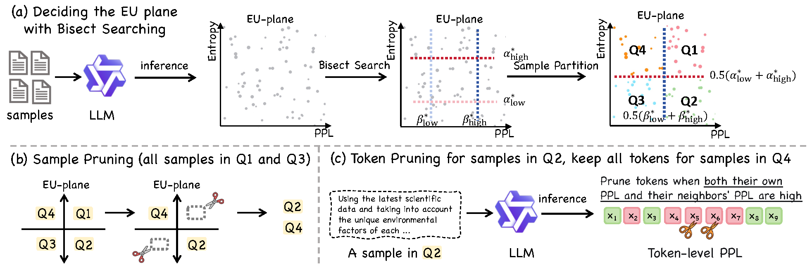
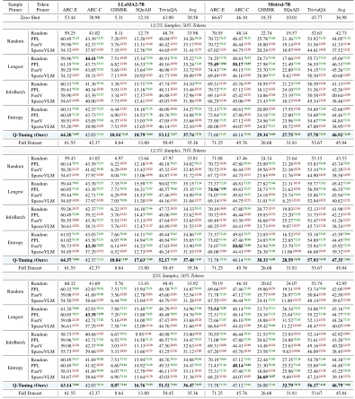

# Q-Tuning: Winning the Pruning Gamble: A Unified Approach to Joint Sample and Token Pruning for Efficient Supervised Fine-Tuning

## 📄 Paper Abstract

As supervised fine-tuning (SFT) evolves from a lightweight post-training step into a compute-intensive phase rivaling mid-training in scale, data efficiency has become critical for aligning large language models (LLMs) under tight budgets. Existing data pruning methods suffer from a fragmented design: they operate either at the sample level or the token level in isolation, failing to jointly optimize both dimensions. This disconnect leads to significant inefficiencies—high-value samples may still contain redundant tokens, while token-level pruning often discards crucial instructional or corrective signals embedded in individual examples. 

To address this bottleneck, we introduce the **Error–Uncertainty (EU) Plane**, a diagnostic framework that jointly characterizes the heterogeneous utility of training data across samples and tokens. Guided by this insight, we propose **Quadrant-based Tuning (Q-Tuning)**, a unified framework that strategically coordinates sample pruning and token pruning. 

Q-Tuning employs a two-stage strategy: first, it performs sample-level triage to retain examples rich in informative misconceptions or calibration signals; second, it applies an asymmetric token-pruning policy, using a context-aware scoring mechanism to trim less salient tokens exclusively from misconception samples while preserving calibration samples in their entirety. 

Our method sets a new state of the art across five diverse benchmarks. Remarkably, on SmolLM2-1.7B, Q-Tuning achieves a +38% average improvement over the full-data SFT baseline using only 12.5% of the original training data. As the first dynamic pruning approach to consistently outperform full-data training, Q-Tuning provides a practical and scalable blueprint for maximizing data utilization in budget-constrained LLM SFT.


## 🔬 Method Overview

<div align="center">
  
</div>

The **Error-Uncertainty (EU) Plane** is a diagnostic tool used to categorize each training sample based on two orthogonal metrics:

- **Error Axis**: Quantified by perplexity (PPL), measuring how surprising a ground-truth sequence is to the model
- **Uncertainty Axis**: Quantified by predictive entropy (Ent), measuring the model's indecision or probability distribution breadth

By plotting each sample on this plane, the data is partitioned into four distinct quadrants, enabling a principled approach to data pruning.

<div align="center">
  
</div>

The pipeline diagram above illustrates our two-stage Q-Tuning strategy: sample-level triage followed by asymmetric token-level pruning, demonstrating how we coordinate both dimensions for optimal data utilization.

## 🎯 Key Contributions

- **Generalized Dynamic Data Pruning**: We formalize the joint sample-token pruning problem through a bilevel optimization objective for hybrid pruning strategies.

- **Error-Uncertainty (EU) Plane**: We introduce a diagnostic tool that quantifies and explains why naive pruning heuristics fail, revealing the heterogeneous value of data across error and uncertainty dimensions.

- **Q-Tuning**: We propose the first integrated, diagnosis-driven algorithm for dynamic pruning that coordinates sample and token decisions based on EU Plane insights.

## 📊 Experimental Results

Our experiments demonstrate that Q-Tuning often matches or surpasses full-dataset fine-tuning while using only a fraction of the training budget:

- On LLaMA2-7B, with 25% of the samples and 70% of the tokens, Q-Tuning achieves 36.9, closely matching the full-data baseline
- On Mistral-7B, the same budget yields 46.2, slightly higher than the full-data result
- Q-Tuning consistently outperforms existing methods like InfoBatch, PPL, and SparseVLM under the same budgets

<div align="center">
  
</div>

## 🔍 Data Pruning Analysis

<div align="center">
  
</div>

Our ablation studies demonstrate the effectiveness of Q-Tuning's coordinated pruning approach:

- **Panel (a)**: Dynamic sample pruning with all tokens retained - Q-Tuning outperforms all baseline methods
- **Panel (b)**: Dynamic token pruning with all samples retained - Q-Tuning consistently achieves superior performance

This comparison validates our core insight: coordinating sample and token pruning decisions yields better results than applying them independently, highlighting the importance of our unified Q-Tuning framework.

## 🚧 Code Status

**⚠️ Note: The code is currently being updated and will be released soon.**

We are actively working on:  
- [x] Project Page
- [ ] Code optimization and documentation
- [ ] Additional experimental results
- [ ] User-friendly implementation guides

Please stay tuned for the official release!

## 📚 Citation

```bibtex
@misc{wang2025winningpruninggambleunified,
      title={Winning the Pruning Gamble: A Unified Approach to Joint Sample and Token Pruning for Efficient Supervised Fine-Tuning}, 
      author={Shaobo Wang and Jiaming Wang and Jiajun Zhang and Cong Wang and Yue Min and Zichen Wen and Fei Huang and Huiqiang Jiang and Junyang Lin and Dayiheng Liu and Linfeng Zhang},
      year={2025},
      eprint={2509.23873},
      archivePrefix={arXiv},
      primaryClass={cs.CL},
      url={https://arxiv.org/abs/2509.23873}, 
}
```


**Contact**: ``shaobowang1009@sjtu.edu.cn``


